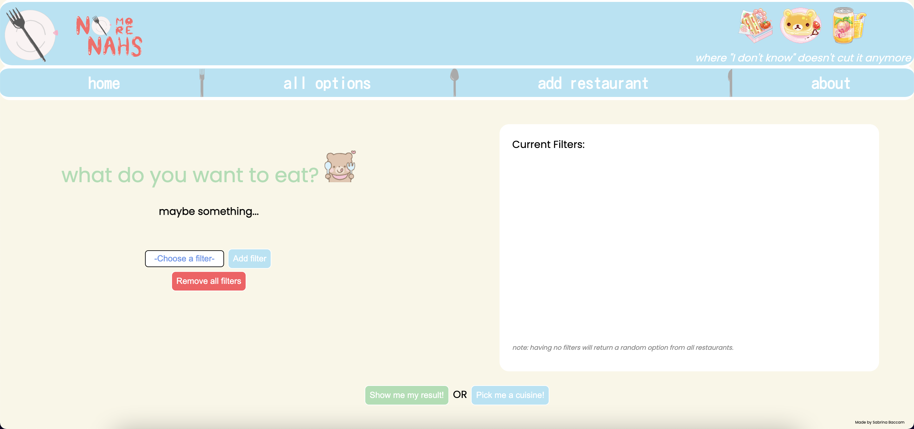

# 🍽️ No More Nahs! 🍴

<h2><strong>Overview:</strong></h2>
1. Introduction and Purpose 
2. Tech Stack 
3. Features and Visuals 
4. Future Considerations 
5. Things to Improve 
6. Bugs 
7. Local Hosting Instructions 
 
 
<h2><strong>Introduction:</strong></h2>
<h3>No More Nahs is a full-stack application for all those picky eaters in your life. Inspired by my love of food, the desire to put SQL into practice to prepare for my data analytics studies, and my new bear65 v2 keyboard I finished building during this week. My project came to fruition during my first half of my coding journey at Devmountain. Imagine this scenario to help you understand the use case of this project: </h3>
<i>You: Hey, what do you want to eat? 
Partner: Hmm, I don't know. 
You: How about McDonald's? 
Partner: Nah, I don't want American food. 
You: How about Cava? 
Partner: Nah, I want to eat somewhere that has alcohol. 
You: Okay... Maggiano's? 
Partner: Ugh, no. But I still want soup and salad there. 
You: Fine! Olive Garden?! 
Partner: ... Nah.... 
You: [sobs quietly] La... La Madeleine... Please... 
Partner: You should've just said so! Wait... Actually, nah! 
You: [exit, pursued by a bear]</i>
  
Frustrating, no? Watch this demo video to see me vocalize the story and test out my application.
Hosted site <a href="https://www.no-more-nahs.herokuapp.com">here</a> until I run out of the $5 needed to host my site.
  

<h2><strong>Tech stack:</strong></h2>
🍽️	Languages: JavaScript, HTML, CSS, SQL 
🍽️	Libraries/Frameworks: Axios, Express.js, Node.js, Sequelize 
🍽️	Developer Tools: PostgreSQL, Heroku, Git, GitHub, Postman 
🍽️	Design Tools: Figma, 3D Paint, Coolors.co 
🍽️	Other Tools: The answered questions on Stack Overflow from someone that asked the exact same question I had, except from like... two years ago
  
 
<h2><strong>Features and Visuals:</strong></h2>
Home Screen:

##### Home screen is accessible by either clicking the large plate icon (spins upon hover), the logo, or the home button in the navigation bar. #####
 
Features include: 
1. Fixed navigation bar with clickable logos, a home button, a button to view the database, a button to redirect to a page to add restaurant options, and a static HTML page to see more information 
2. Dropdown box to select applicable filters, uses a GET request to the backend that houses a SQL table of "tags"  
3. Buttons. Lots of buttons. But specifically a button to add the filter to the right-hand side so the user can ensure their tag is being applied to the conditional. 
4. Button to delete all applied filters 
5. Button to generate a random restaurant to eat at with the filters specified (or none) 
6. Button to generate a random <i>cuisine</i> that relies on no applied filters 
7. Different cursor option used for browsing, you know, for funsiez
  

##### Home screen displays some filters added on the right-hand side in a div. #####
 
Features include: 
1. Div displaying applied filters 
2. Trash can icon that allows a filter to be removed from the div and removed from the conditional of the JavaScript function via a delete request
  

##### Alert shown via DOM manipulation for error prevention. #####
 
Features include: 
1. Alert message after clikcing the red remove all filters option for error prevention 
2. Clicking OK will remove all filters from the right-side div without needing to click each red trash can icon
  

##### Once the green results button is pressed, a modal pops up to show a loader. #####
 
Features include: 
1. Pop-up modal displayed upon clicking the green button 
2. An exit button that changes color upon hover to close the modal 
3. Disabled being able to click outside the modal to exit (error prevention purposes) 
4. CSS loader animation with a bear image I ripped off the internet and positoned over to spin for 3 seconds
  

##### Modal hides the loader and displays the result. #####
 
Features include: 
1. Randomly generated result from JavaScript function appears after 3 seconds 
2. Loader is hidden before result is generated 
3. Error prevention from clicking any button too fast implemented 
4. Repeatedly exiting and generating a result will ensure a cleared modal to prevent results from piling on  

##### Modal will have the same loader, but a cuisine is generated instead of a specific restaurant name. #####
 
Features include: 
1. Randomly generated cuisine option <i>independent</i> of filters
  

##### Database shown as "cards". Similar icon shown to delete options from the database. Running the seed API can re-seed the database in case someone went ham with the buttons. #####
 
Features include: 
1. Each option in the database shown as cards in alphabetical order 
2. Each tag is displayed in an unordered list 
3. Button to remove an option from the database powered by a delete request to the backend
  

##### Add restaurant page with a similar function tot he landing page, but functions to add restaurants to the database as an option for the user. #####
 
Features include: 
1. Similar buttons to the home page 
2. Text box to input name of the restaurant 
3. Green button to add restaurant to the database, accessible to view in the all options link in the navigation bar
  

##### Static HTML page #####
 
Features include: 
1. Snail-mail styled static HTML page to help explain the site 
2. Links to redirect back to the needed page
 
 

<h2><strong>Future Considerations:</strong></h2>
<ul>
<li>Utilize a PUT request to update tags within a restaurant's "card" in the database</li>
<li>Login page to prevent sharing databases</li>
<li>Option to add your own tags</li>
</ul>

<h2><strong>Things to Improve:</strong></h2>
<ul>
<li> The way I implemented the CSS loader to show the function result was gimmicky. I utilized a setTimeout function and changed the display of the loader. I did this to avoid using async/await promises since the loading time for the function was not long enough to appreciate the CSS loader I spent time on picking cute colors for.
<li>The UI is not the best looking. I would have wished to consulted different points of view about the overall look if time allowed.</li>
<li>The SQL tables generated are VERY odd, but it was an unorthodox way that still functioned at the very least. Once I understand more about relational databases and joining tables, I most likely would have approached the database architecture differently.</li>
<li>Memory usage was not taken into account when building this project.</li>
</ul>

<h2><strong>Bugs:</strong></h2>
<ul>
<li>Changing the database will affect ALL users</li>
<li>Application is not properly formatted for all screen resolutions</li>
</ul>

<h2><strong>Local Hosting Instructions:</strong></h2>
1. XXXXX

 
P.S. I had a great time creating this application! And by great time, I mean I wanted to cry. And by cry, I mean vomit. But "time passes, people move. Like a river's flow, it never ends. A childish mind will turn to noble ambition. Young love will become deep affection." Learning is a growing pain, and I can't wait to create more projects to push my limits as a SWE!